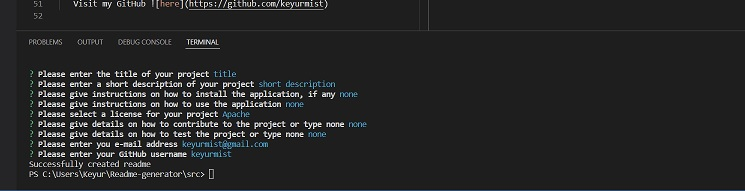

# Readme-generator

## Description

A professional README file generated by using inquirer.

## Installation

```
git clone https://github.com/keyurmist/Readme-generator.git
cd Readme-generator
npm install
```

# Getting Started

In order to run the application do the following:

```
npm run start
```

## Screenshot

Below is the terminal showing the answered questions which resulted in the readme being generated.



To view the walkthrough video use this link: https://drive.google.com/file/d/1Kt44bWr4PKqeG49hC0QunC34jdL-U2rk/view
